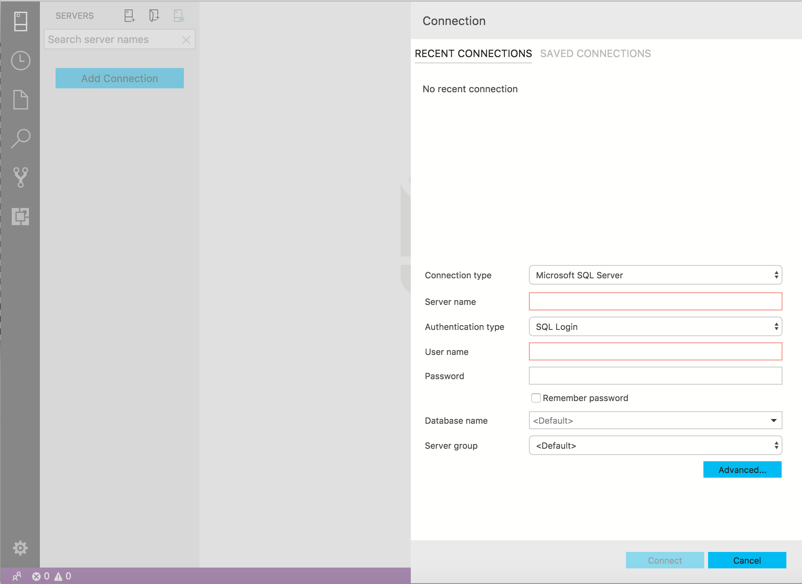
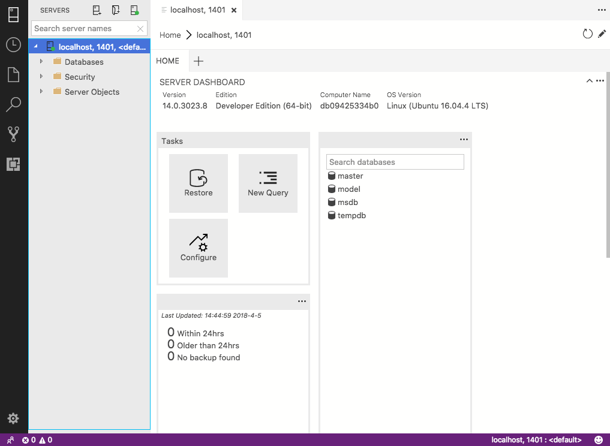

# Microsoft SQL + Northwind DB Training / Test Environment

There are many training resources out there that allow you to practice SQL directly in the browser although nothing quite replaces having an environment of your own to tinker.

We have created a Docker image based on `microsoft/mssql-server-linux` a container built by Microsoft which is built on top of a linux server.

# The Training Container

This container had a MS SQL server this particular server has been set up as a developer edition. It is important to be aware of the licensing around the developer edition which is below:

_SQL Server Developer edition lets developers build any kind of application on top of SQL Server. It includes all the functionality of Enterprise edition, but is licensed for use as a development and test system, not as a production server. SQL Server Developer Edition cannot be used in a production environment. The SQL Server 2017 Developer Edition license terms are located [here](https://go.microsoft.com/fwlink/?linkid=857698)._

The site for the base container from MS can be found [here](https://hub.docker.com/r/microsoft/mssql-server-linux/).

**container update** -> We have added MSSQL command line tools and have installed the Northwind DB for training purposes.

## Downloading the container

Trusting you have Docker installed head to the terminal or command line and type:

`docker pull spartagl/sqlnorthwind`

Once downloaded you will need to run the container by using the below command:

`docker run -d --name sql1 -p 1433:1433 spartagl/sqlnorthwind`

**Command Breakdown**

Just to be clear in what we are doing above let's break down the commands:

`docker run` -> When `docker run` is executed the container process that runs is isolated in that it has its own file system, its own networking, and its own isolated process tree separate from the host. In short we're asking to create the container.

`-d` -> This runs the container in detached mode. Essentially it means the container will run in the background allowing you to use exposed resources locally (as an example) or attache to the container itself.

`--name sql1` -> Naming your container is good practice and the --name flag allows you to do this. This is not mandatory however as Docker will name containers automatically.

`-p 1433:1433` -> the `p` flag maps ports from your container to your localhost. In this instance we are mapping port `1433` from the container to port `1433` on our localhost. 

`spartagl/sqlnorthwind` -> This is the base image name to create the local container from.

## Azure Data Studio

You can download the cross platform tool SQL Operations Studio from [here](https://docs.microsoft.com/en-us/sql/azure-data-studio/download-azure-data-studio).

Once opened you should see the below image:

To log into the image when prompted for login credentials input:

Connection type -> `Microsoft SQL Server`

Server -> `localhost, 1433`

Authentication type -> `SQL Login`

Username -> `SA`

Password -> `SA@SpartaGlobal`

Once logged in you should see the below screen:

You are now ready to begin.

# Supporting Resources

## Azure Data Studio guide
You will be able to find documentation on how to use Azure Data Studio [here](https://docs.microsoft.com/en-us/sql/sql-operations-studio/tutorial-sql-editor).

## W3C schools examples

A very useful guide for Learning SQL that directly relates to the Northwind database can be found [here](https://www.w3schools.com/sql/).
